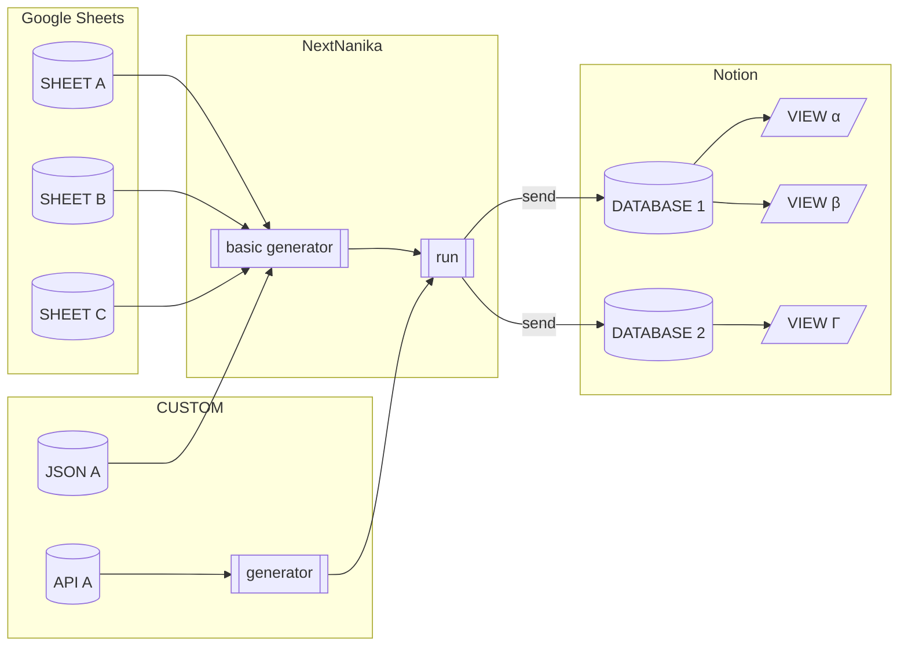
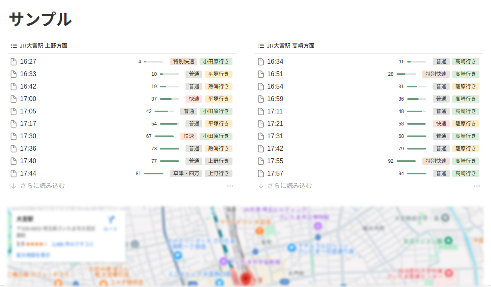
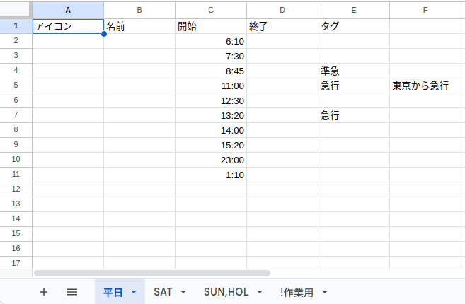
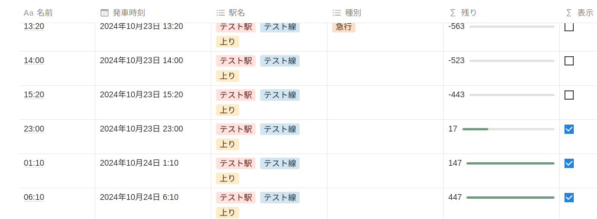

# gas-notion-next-nanika

Notion で次の何かの時刻を確認するためのライブラリー。



## Example



## Setup

ライブラリーは App Script で利用できる状態になっています。
Apps Script のコードエディターで以下の手順を実行するとプロジェクトへ追加できます。

1. コードエディターのファイル名一覧が表示される部分の「ライブラリ +」をクリック
1. 「スクリプト ID」フィールドに `1Mf17VPjf-OuKoxWNoJJbagig1O9kmK6yOXbHM270vMqsYskKXA_2CEWE` を入力し検索をクリック
1. バージョンを選択(通常は最新版)
1. 「ID」を `NextNanika` へ変更
1. 「追加」をクリック

上記以外にも Release ページから `gas-notion-next-nanika.zip` をダウンロードし、`/dist` ディレクトリーをプロジェクトへコピーできます。

## Usage

Notion のデータベースを時刻表的に利用する手順です。データの入力には Google スプレッドシートを利用します。

### Notion データベースを作成

以下のプロパテパティを持つデータベースを作成します。

- `名前` : タイトル - テキストとして発車時刻が "HH:MM" 形式で保存されます
- `発車時刻` : 日付 - 発車時刻の日付が保存されます
- `駅名` : マルチセレクト - 駅名、路線名、行き先などが保存されます
- `種別` : マルチセレクト - 種別が保存されます
- `表示` : 数式 - `prop("発車時刻") > now()` フィルターに設定することで発車時刻が現在時刻より後のものが表示されます
- `残り` : 数式 - `dateBetween(prop("発車時刻"),now(), "minutes")` 発車までの残り時間が表示されます)

### Notion インテグレーションを作成

Notion 外部からデータベースを操作するためのインテグレーション(API KEY)が必要です。以下を参考に作成してください。なお、コンテンツ機能はすべてオンである必要があります。

- [Create your integration in Notion](https://developers.notion.com/docs/create-a-notion-integration#create-your-integration-in-notion)

以下を参考に、インテグレーションにページ(データベース)の変更権限を与えてください。

- [Give your integration page permissions](https://developers.notion.com/docs/create-a-notion-integration#give-your-integration-page-permissions)

## Google スプレッドシートにデータを入力

以下のようなスプレッドシートを作成します(ファイル名のは任意です、とりあえずという場合は "テスト駅 テスト線 上り" としてください)。



#### シート名

- `平日` : 平日のデータを入力(最初のシートのシート名は任意です、他シートの曜日がヒットしないとき最初のシートが利用されます)
- `SAT` : 土曜日のデータを入力(これ以降のシートはカンマ区切り英数半角大文字の曜日名で指定)
- `SUN,HOL` : 日曜日と休日のデータを入力

作業などに使うシートはシート名の先頭を `!` にすることで、データベース送信の対象から外すことができます。

#### 入力データ

- `A 列` : アイコン(任意) - Notion のページアイコンに使える絵文字を入力できます
- `B 列` : 名前(任意) - ページのタイトルになります、ブランクの場合は `HH:MM` が使われます
- `C 列` : 開始 - 発車時刻を入力します(型は任意ですが、表示は `HH:MM` にしておく必要があります)
- `D 列` : 終了 - 終了時刻を入力します(時刻表ではブランクになります)
- `E 列` : タグ(任意) - 種別などを入力します、この列以降はすべてタグとして扱われます(Notion のマルチセレクトに対応)

なお、スクリーンショットでは 1 行目に列名を入力していますが、この行は単純にスキップされるので入力を省略できます。

#### 最終発車時刻について

日付をまたいだ最終発車時刻についても、多くの場合で人間用の時刻表の通りに `25:30` や `01:30` のように入力できます。
(`00:00` から `01:59` までは翌日の時刻として Notion へ送信します)

### GAS プロジェクトを作成(ライブラリーの利用)

以下の手順で GAS プロジェクトを作成し、ライブラリーを利用します。

- 新規で GAS プロジェクトを作成
- プロジェクトの設定でタイムゾーンを指定します
  - Notion データベースを表示する実行環境のタイムゾーンと合わせる必要があります
  - 日本で利用している場合であれば通常は `(GMT+09:00) 日本標準時 – 東京` で問題ないはずです
- プロジェクトのプロパティに以下を追加
  - `NOTION_API_KEY` : Notion インテグレーションの API KEY
  - `NOTION_DATABASE_ID` : Notion データベースの ID
- ライブラリーに `NextNanika` を追加(手順は Setup を参照)

以下のコードをプロジェクトに追加します。

```javascript
async function start() {
  const props = PropertiesService.getScriptProperties()
  const apiKey = props.getProperty('NOTION_API_KEY')
  const databaseId = props.getProperty('NOTION_DATABASE_ID')

  const client = NextNanika.makeClient({ auth: apiKey })
  const generators = [
    NextNanika.makeBasicTimeRecGenerator(
      sheetsToTimeTable_(SpreadsheetApp.openById('<スプレッドシートの ID>')),
      ['テスト駅', 'テスト線', '上り']
    )
  ]
  await NextNanika.run(client, {
    databaseId,
    timeRecGenerator: generators,
    propNames: {
      name: '名前',
      time: '発車時刻',
      tags: ['駅名', '種別']
    }
  })
}

function sheetsToTimeTable_(spreadSheet) {
  const iconCol = 0
  const nameCol = 1
  const startHHMMCol = 2
  const endHHMMCol = 3
  const tagsCol = 4

  const sheets = spreadSheet
    .getSheets()
    .filter((s) => !s.getName().startsWith('!'))
  const tt = []

  for (const s of sheets) {
    const t = {
      dayKind: [...s.getName().split(',')],
      recs: []
    }

    const range = s.getDataRange()
    const values = range.getDisplayValues()
    for (const row of values.slice(1)) {
      const rec = {}
      if (row[iconCol]) {
        rec.icon = row[iconCol]
      }
      if (row[nameCol]) {
        rec.name = row[nameCol]
      }
      const startHHMM = row[startHHMMCol].split(':')
      rec.start = {
        hh: startHHMM[0],
        mm: startHHMM[1]
      }
      if (row[endHHMMCol]) {
        const endHHMM = row[endHHMMCol].split(':')
        rec.end = {
          hh: endHHMM[0],
          mm: endHHMM[1]
        }
      }
      rec.tags = row
        .slice(tagsCol)
        .filter((c) => typeof c === 'string' && c != '')
      t.recs.push(rec)
    }
    //console.log(JSON.stringify(t, null, 2))
    tt.push(t)
  }
  return tt
}
```

コードを追加したら手動で `start` 関数を実行します。このとき権限について確認されるので、内容を確認し許可してください。

成功すると当日を含めて 3 日分のデータが Notion へ送信されます。また、このときにデータベース上の発車時刻が 10 時間以前のレコード(ページ)をゴミ箱へ移動します。

必要に応じてビューを作成することで直近の時刻表を確認できます。



定期的にデータを送信する場合はトリガーを設定してください。どの時刻に起動しても当日を起点に処理するので、時刻の指定は任意です。

#### 休日について

休日は Google カレンダーの「日本の祝日(`ja.japanese#holiday@group.v.calendar.google.com`)」を元に判定していますが、このカレンダーは現在(2024 年 10 月時点で)その名前に反してデフォルトでは祝日以外のイベントが設定されています。

祝日以外のイベントを除外する場合は、以下の記事を参考に「日本の祝日」カレンダーを再作成し、`getDayKind` オプションを以下のように指定してください。

- [\[GAS\] カレンダーの「祝日のみ」と「祝日およびその他の休日」 #GoogleAppsScript - Qiita](https://qiita.com/sakaimo/items/0a0a31697dd821e775cd)

```javascript
await NextNanika.run(client, {
  databaseId,
  timeRecGenerator: generators,
  propNames: {
    name: '名前',
    time: '発車時刻',
    tags: ['駅名', '種別']
  },
  dayKindGetter: NextNanika.makeDayKindGetter([
    'ja.japanese.official#holiday@group.v.calendar.google.com'
  ])
})
```

ただし、これでも「銀行休業日」などが設定されています。細かく調整した場合は後述の「任意の休日指定」を参照してください。

## Applications

### 1 つのデータベースに複数の時刻表

1 つのデータベースに複数の時刻表(スプレッドシート)を送信する場合、大きく 2 つの方法があります。

#### `NextNania.run()` を複数回実行する

```javascript
const generator1 = [
  NextNanika.makeBasicTimeRecGenerator(
    sheetsToTimeTable_(SpreadsheetApp.openById('<スプレッドシート 1 の ID')),
    ['テスト駅', 'テスト線', '上り']
  )
]
await NextNanika.run(client, {
  databaseId,
  timeRecGenerator: generator1,
  propNames: {
    name: '名前',
    time: '発車時刻',
    tags: ['駅名', '種別']
  }
})

const generator2 = [
  NextNanika.makeBasicTimeRecGenerator(
    sheetsToTimeTable_(SpreadsheetApp.openById('<スプレッドシート 2 の ID')),
    ['テスト駅', 'テスト線', '下り']
  )
]
await NextNanika.run(client, {
  databaseId,
  timeRecGenerator: generator2,
  propNames: {
    name: '名前',
    time: '発車時刻',
    tags: ['駅名', '種別']
  }
})
```

この方法の場合、プロジェクトを分割するなどして、それぞれの処理を独立させることができます。

ただし、`NextNanika.run()` は重複チェックのために前処理として Notion 側からデータを取得する処理が含まれます(前述のように cleanup 処理も含まれます)。よって、複数回実行すると全体の処理時間が増加します。

#### `NextNania.run()` にまとめて generator を渡す

```javascript
const generators = [
  NextNanika.makeBasicTimeRecGenerator(
    sheetsToTimeTable_(SpreadsheetApp.openById('<スプレッドシート 1 の ID')),
    ['テスト駅', 'テスト線', '上り']
  ),
  NextNanika.makeBasicTimeRecGenerator(
    sheetsToTimeTable_(SpreadsheetApp.openById('<スプレッドシート 2 の ID')),
    ['テスト駅', 'テスト線', '下り']
  )
]
await NextNanika.run(client, {
  databaseId,
  timeRecGenerator: generators,
  propNames: {
    name: '名前',
    time: '発車時刻',
    tags: ['駅名', '種別']
  }
})
```

この方法の場合、`NextNanika.run()` は 1 回だけ実行されるため、処理時間が短縮されます。

ただし、1 つのデーベースに多くのページが含まれると `NextNanika.run()` の前処理(Notion からのデータ取得)に時間がかかるため、1 回の実行でも GAS の実行時間制限に引っかかる可能性が高くなります。

### 送信数を制限する

`NextNanika.run()` は送信するページ数を制限するためのオプションを持っています。以下のように設定することで、送信するページ数を制限できます。

```javascript
await NextNanika.run(client, {
  databaseId,
  timeRecGenerator: generators,
  propNames: {
    name: '名前',
    time: '発車時刻',
    tags: ['駅名', '種別']
  },
  limit: 100
})
```

この場合 100 ページまで送信されます。送信するページ数が 100 ページを超える場合、次回の実行で残りのページが送信されます(厳密に言うと重複していないページが送信されます)。

トリガーによる実行がタイムアウトになる場合、送信数を制限することで実行時間を短縮できます。

### 処理する日数を変更する

`NextNanika.run()` は送信する日数を制限するためのオプションを持っています。以下のように設定することで、送信する日数を制限できます。

```javascript
await NextNanika.run(client, {
  databaseId,
  timeRecGenerator: generators,
  propNames: {
    name: '名前',
    time: '発車時刻',
    tags: ['駅名', '種別']
  },
  daysToProcess: 2
})
```

`limit` と似ていますが、こちらはデータベースに登録される総ページ数を制限できます。

`NextNanika.run()` の前処理に時間がかかる場合、送信する日数を制限することで実行時間を短縮できます。

### cleanup のみ実行する

`NextNanika.cleanup()` を利用することで、任意の範囲のページをゴミ箱へ移動できます。

```javascript
async function cleanup() {
  const props = PropertiesService.getScriptProperties()
  const apiKey = props.getProperty('NOTION_API_KEY')
  const databaseId = props.getProperty('NOTION_DATABASE_ID')
  const client = NextNanika.makeClient({ auth: apiKey })

  await NextNanika.cleanup(client, databaseId, 60 * 5, '発車時刻')
}
```

`NextNanika.run()` よりも短い間隔でトリガーを設定しておくと、`NextNanika.run()` での cleanup 処理を軽減できます。

### Googe スプレッドシート以外でのデータ記述

以下のようにコードを記述すると、任意のデータを生成するジェネレーターを作成できます。

```javascript
const generator1 = NextNanika.makeBasicTimeRecGenerator(
    [
      {
        dayKind: [],
        recs: [
          { start: { hh: 7, mm: 20 }, tags: ['急行', '東京'] },
          { start: { hh: 8, mm: 20 }, tags: ['快速'] }
        ]
      },
      {
        dayKind: ['SAT'],
        recs: [
          { start: { hh: 7, mm: 20 }, tags: ['急行', '東京'] },
          { start: { hh: 8, mm: 20 }, tags: ['快速'] }
        ]
      },
      {
        dayKind: ['SUN', 'HOL'],
        recs: [
          { start: { hh: 7, mm: 20 }, tags: ['急行', '東京'] },
          { start: { hh: 8, mm: 20 }, tags: ['快速'] }
        ]
      }
    ]
```

この他、所定の型でデータを生成することで任意のコードでジェネレーターを作成できます。驚異があれば、`src/generator.ts` を参照してください。

### 任意の休日指定

Google カレンダーの任意のカレンダーを休日判定に利用する方法です。

以下のようにカレンダー ID の配列を渡すことで、いずれかのカレンダーにイベントがある日は休日と判定されます。

```javascript
await NextNanika.run(client, {
  databaseId,
  timeRecGenerator: g,
  propNames: {
    name: '科目名',
    time: '授業時間',
    tags: ['期間', '備考']
  },
  dayKindGetter: NextNanika.makeDayKindGetter([
    'ja.japanese.official#holiday@group.v.calendar.google.com',
    '< カレンダー ID >'
  ]),
  startDaysOffset: 6,
  daysToProcess: 30,
  limit,
  skipCleanup: true
})
```

なお、日本の祝日カレンダーを利用する場合は、配列にそのカレンダーの ID も含める必要があります。
(上記サンプルは「日本の祝日」カレンダーから「その他の行事」を除外して作り直した場合のカレンダー ID を渡しています)

### 日の種類判定

以下の型で関数を作成し、`NextNanika.run()` の `opts.dayKindGetter` に渡すと任意の日付を休日として扱うことができます。

```typescript
type DayKind = 'SUN' | 'MON' | 'TUE' | 'WED' | 'THU' | 'FRI' | 'SAT' | 'HOL'

type GetDayKind = (baseTime: Date) => DayKind
```

## TypeScript

TypeScript(clasp) でコードを記述している場合は、以下の方法で型定義を設定できます。

型定義パッケージをインストールします。

```console
$ npm install --save-dev @hankei6km/gas-notion-next-nanika
```

`tsconfig.json` に定義を追加します。

```json
{
  "compilerOptions": {
    "target": "ES2019",
    "module": "ES2020",
    "lib": ["ESNext"],
    "types": ["@types/google-apps-script", "@hankei6km/gas-notion-next-nanika"]
  }
}
```

## License

MIT License

Copyright (c) 2024 hankei6km
